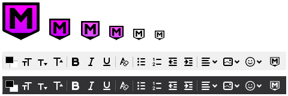

# Markdown-Here Alt.Icon

This is a **fork** of [**markdown-here-revival**](https://gitlab.com/jfx2006/markdown-here-revival), a [Thunderbird](https://www.thunderbird.net/) markdown renderer and syntax highlighter.

**Markdown-Here Alt.Icon** simply provides **alternative** main and formatting-toolbar **icons** more aligned with Thunderbird's icon design.
   
<span align="left"></span>

Homepage:  
GitHub (main) - https://github.com/Gregory-K/Markdown-Here.Alt.Icon  
GitLab (alt.) - https://gitlab.com/Gregory.K/Markdown-Here.Alt.Icon

Version:  
**3.4.3.1**  
Compatibility:  
91.0 <= Thunderbird version >= 107.0


## Install / Update

Download the latest .xpi [release from GitHub](https://github.com/Gregory-K/Markdown-Here.Alt.Icon/releases) and install it manually into Thunderbird.  
_(drag 'n drop OR "gear menu > Install Add-on From File...")_

Repeat for updates.  
_The "Markdown-Here Alt.Icon" follows the official "markdown-here-revival" releases by adding an extra decimal place at the end._


## Caution

This altered extension was only intended for the author's personal use, and it doesn't offer anything more than a different main icon design. It was plain experimentation now being offered "as is" for anyone to try. It is neither digitally signed nor distributed via the official Thunderbird channels.

You should not use unsigned Add-ons outside the official [Thunderbird Add-ons Repository](https://addons.thunderbird.net/thunderbird/), unless you trust the author/developer or you're able to inspect the source code. It is a serious security risk. The author of the present extension disclaims any responsibility for any damage caused to your Thunderbird installation.

If you are not sure about using this extension, please prefer the official one bellow.


## Notes

The present repository contains only the files needed for an .xpi release.
The whole codebase resides in a different GitLab repository under the ["Alt.Icon"](https://gitlab.com/Gregory.K/markdown-here-revival/-/tree/Alt.Icon) branch.

Versioning: one decimal after the official one  
e.g. `3.1.1` (official) `3.1.1.1` (Alt.Icon)


---


# Official "markdown-here-revival" extension

[GitLab markdown-here-revival Repository](https://gitlab.com/jfx2006/markdown-here-revival)

[Thunderbird Add-ons listing](https://addons.thunderbird.net/thunderbird/addon/markdown-here-revival/)


## Official README

*Markdown Here Revival* is a fork of Markdown Here, the popular browser extension
specifically targeting modern Thunderbird versions
It lets you write email<sup>&dagger;</sup> in Markdown<sup>&Dagger;</sup> and
render them before sending. It also supports syntax highlighting (just specify
the language in a fenced code block).

Unfortunately, attempts by a few members of the user community to contact
the author of Markdown Here have been unsuccessful.


### Table of Contents
**[Installation Instructions](#installation-instructions)**  
**[Usage Instructions](#usage-instructions)**  
**[Troubleshooting](#troubleshooting)**  
**[Compatibility](#compatibility)**  
**[Notes and Miscellaneous](#notes-and-miscellaneous)**  
**[Building](#building)**  
**[Feedback](#feedback)**  
**[License](#license)**  


### Installation Instructions

Download from [addons.thunderbird.net](https://addons.thunderbird.net/en-US/thunderbird/addon/markdown-here-revival/)


### Usage Instructions

Install it, and then…

1. Make sure you've set "Compose messages in HTML format"
4. Compose an email in Markdown. For example:

   <pre>
   **Hello** `world`.

   ```javascript
   alert('Hello syntax highlighting.');
   ```
   </pre>

5. Click the button that appears in the format toolbar.
6. You should see your email rendered correctly from Markdown into rich HTML.
7. Send your awesome email to everyone you know. It will appear to them the same way it looks to you.

#### Revert to Markdown

After rendering your Markdown to pretty HTML, you can still get back to your original Markdown.
Just click that toggle button again.

Note that any changes you make to the pretty HTML will be lost when you revert to Markdown.

#### Replies

Just reply as normal, any quoted replies will be ignored.
(Technically: Existing `blockquote` blocks will be left intact.)


#### Options

The Options page can be accessed via Thunderbird extensions list. The available options include:

* Styling modifications for the rendered Markdown.
* Syntax highlighting theme selection and modification.
* TeX math formulae processing enabling and customization.
* What the hotkey should be.


### Troubleshooting

Coming soon!


### Compatibility

This is a mail extension for Mozilla Thunderbird. It will not work in a web
browser such as Firefox or any other e-mail software.


### Notes and Miscellaneous

* *Markdown Here Revival* uses [Github Flavored Markdown](http://github.github.com/github-flavored-markdown/).

* Available languages for syntax highlighting will soon be listed on the options
  page.

* Email signatures are automatically excluded from conversion.

* Styling:
  * The use of browser-specific styles (-moz-, -webkit-) should be avoided.
    If used, they may not render correctly for people reading the email
    in a different browser from the one where the email was sent.
  * The use of state-dependent styles (like `a:hover`) don't work because
    they don't match at the time the styles are made explicit. (In email,
    styles must be explicitly applied to all elements -- stylesheets get stripped.)


### Building

Use [web-ext](https://extensionworkshop.com/documentation/develop/getting-started-with-web-ext/),
mostly the same as you would for Firefox. A config file is included to make it
use Thunderbird.


### Feedback

See the [issues list](https://gitlab.com/jfx2006/markdown-here-revival/-/issues)
and the [Wiki](https://gitlab.com/jfx2006/markdown-here-revival/-/wikis/home).
All ideas, bugs, plans, complaints, and dreams will end up in one of those two places.


### License

#### Code

MIT License: See [the LICENSE file](LICENSE).

#### Other images

[Creative Commons Attribution 3.0 Unported (CC BY 3.0) License](https://creativecommons.org/licenses/by/3.0/)
